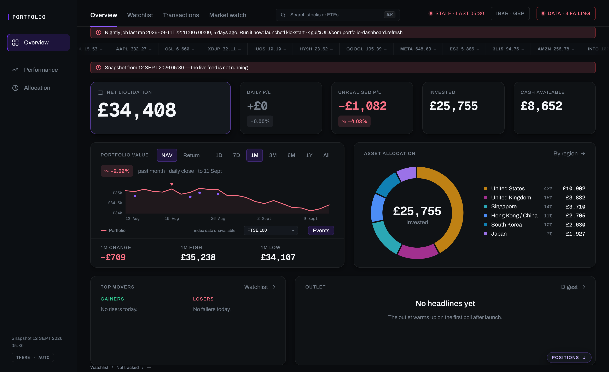

# Portfolio Dashboard

A live investment dashboard for an Interactive Brokers account, in pounds.
One page, four tabs, a drill-in stock page, and a Python adapter that keeps
the numbers honest: a held-open connection to IB Gateway while it is up, an
end-of-day fallback when it is not, and a nightly job that records history.

The front end is plain HTML, CSS and JavaScript with no framework and no
build step. The charts are SVG drawn by the app's own chart module. The
backend is a small Python server with a background feed thread.



*The Overview on the mock dataset, captured a few days after the mock window
closed. The banners and the stale chips are the dashboard noticing that its
data is old, which is what it is built to do.*

## What it shows

- **Overview.** NAV, cash, invested capital and unrealised P&L, the equity
  curve, an allocation ring, top movers and a ticker tape. Live values
  update every few seconds without a reload.
- **Holdings.** The sector page: owned rows banded above watchlist rows in
  one aligned table, with sector pills and a breadth strip.
- **Market watch.** A world board of index cards that answers a different
  question from the other tabs: what is trading right now and how is it
  moving, with the book's own exposure as the last line on each card.
- **Transactions.** Fills, cash movements, dividends and fees from the
  broker's statements, with realised P&L.
- **Performance and allocation.** Time-weighted and money-weighted returns
  against a benchmark, a two-stage NAV flow Sankey with FX as its own node,
  and the same holdings cut by region, sector and currency.
- **Stock pages.** Price history, ranges, estimates, dividends, financials
  and headlines for any owned or watched name.

Every value that can be stale says so: a feed chip, a health chip and a
disconnected banner that keeps the last numbers on screen rather than
blanking them.

## Try it in five minutes

No broker account, no API keys, no packages beyond Python 3. The repository
ships an invented four-month history for a five-figure GBP portfolio over
the same fifteen contracts the app tracks, and a generator that turns it
into every file the dashboard reads.

```bash
git clone https://github.com/MacMac2070/portfolio-dashboard.git
cd portfolio-dashboard
python3 dashboard/scripts/build_mock_data.py --install --check
python3 dashboard/serve.py --no-live
```

Then open <http://localhost:5173>.

Two things are expected in the demo. The feed chip reports that the server
started without a live source, and the health chip complains that the last
nightly run is old, because the mock window ends on a fixed date and the app
judges it against the real calendar. Both are the dashboard being truthful,
not a fault. Panels that need market data from openbb or yfinance (market
watch, the watchlist, news and the stock pages) stay in their empty states
unless you install the requirements and run without `--no-live`.

The mock dataset is documented in [dashboard/data/mock/README.md](dashboard/data/mock/README.md).

## How the data gets in

Three independent paths on three different clocks, none of which can block
another:

```
LIVE      IB Gateway :4001 ── adapter/feed.py ── GET /api/snapshot ── page polls every 3 s
EOD       Flex Open Positions × delayed quotes ── adapter/flexfeed.py, whenever the Gateway is away
HISTORY   IBKR Flex Web Service ── adapter/refresh.py, nightly ── nav_history.jsonl, transactions.jsonl
WORLD     openbb index series ── adapter/markets.py ── GET /api/markets ── page polls every 30 s
```

The Gateway is an upgrade, not a requirement. When it is unreachable the page
serves yesterday's positions repriced by delayed quotes, and the Gateway
coming back upgrades the chip to live without a restart. Quotes are the
15-minute delayed feed that needs no paid subscription.

History lives in append-only JSONL ledgers merged by key, so a re-run never
duplicates a row. A reconciliation pass replays the ledger against the
broker's own statement (positions, NAV continuity, deposits, composition)
and a health endpoint gives one verdict for the whole pipeline.

## Running it on a real account

1. Python 3.13 with the pinned dependencies:
   `python3 -m pip install -r dashboard/requirements.txt`
   (ib_async, openbb, yfinance, pandas, pytest).
2. IB Gateway on `127.0.0.1:4001`, logged in, API clients enabled.
3. A Flex Web Service token and an Activity Flex query with the Open
   Positions, NAV and trade sections enabled. Copy
   `dashboard/config.local.json.example` to `dashboard/config.local.json`
   and fill it in. This is what fills the equity curve on day one and what
   the end-of-day fallback reads.
4. `python3 dashboard/serve.py` starts the server with the live feed.
   `dashboard/install-daily-job.sh` installs the nightly job (launchd,
   23:30 local) and `dashboard/install-live-feed.sh` keeps the server up
   across reboots. Both are macOS launchd installers.

The installers and a few scripts hardcode the interpreter path this was
built on (`/opt/anaconda3/bin/python3`). Adjust it for your machine.

Check the pipeline any time:

```bash
curl -s localhost:5173/api/health | python3 -m json.tool
python3 dashboard/adapter/health.py
```

The full operating notes, page by page, are in [dashboard/README.md](dashboard/README.md).

## Tests

```bash
cd dashboard && python3 -m pytest tests -q
```

166 tests cover the money maths (FIFO lots, realised and unrealised P&L,
time- and money-weighted returns), the Flex statement parsers, the
reconciliation and health gates, the failover feed, and the mock dataset
itself, which is regenerated and reconciled as part of the suite.

## Repository layout

```
dashboard/          the app: index.html, css/, js/, adapter/ (Python), serve.py, tests/,
                    scripts/build_mock_data.py, data/mock/
expense-tracker/    a separate, backend-only module: bank transactions through an
                    Open Banking aggregator, categorised locally, stored in SQLite
inspiration/        notes and screenshots from other open-source trackers,
                    credited in inspiration/CREDITS.md
Trial 1/            the first prototype, kept for the record
CLAUDE.md, .claude/ the design brief and agent notes the project is built with
```

## Nothing private is in here

No account data enters this repository. The real ledgers under
`dashboard/data/`, the broker credentials in `config.local.json`, review
screenshots and research documents are all gitignored, and the history was
rewritten to remove them before publication. What ships instead is the mock
dataset above.

## Expense tracker

`expense-tracker/` is an isolated, local-first backend that pulls bank
transactions for two UK current accounts through an Open Banking aggregator,
dedupes them, categorises them with a local model and stores them for a
future dashboard tab. It shares nothing with the dashboard's code or data.
Its roadmap and hard stops are in
[expense-tracker/PLAN.md](expense-tracker/PLAN.md).

## Design and credits

The visual language, the financial semantics (signed and coloured P&L,
tabular figures, compact GBP notation) and the required loading, empty and
stale states are set out in [CLAUDE.md](CLAUDE.md), which the project is
built against with Claude Code. Layout ideas taken from other open-source
trackers are credited in [inspiration/CREDITS.md](inspiration/CREDITS.md).

## Licence

MIT, see [LICENSE](LICENSE). It covers this project's own code and
documentation. The screenshots and copied files under `inspiration/` and the
site screenshot in `Trial 1/` belong to their owners, as set out in
[inspiration/CREDITS.md](inspiration/CREDITS.md).
